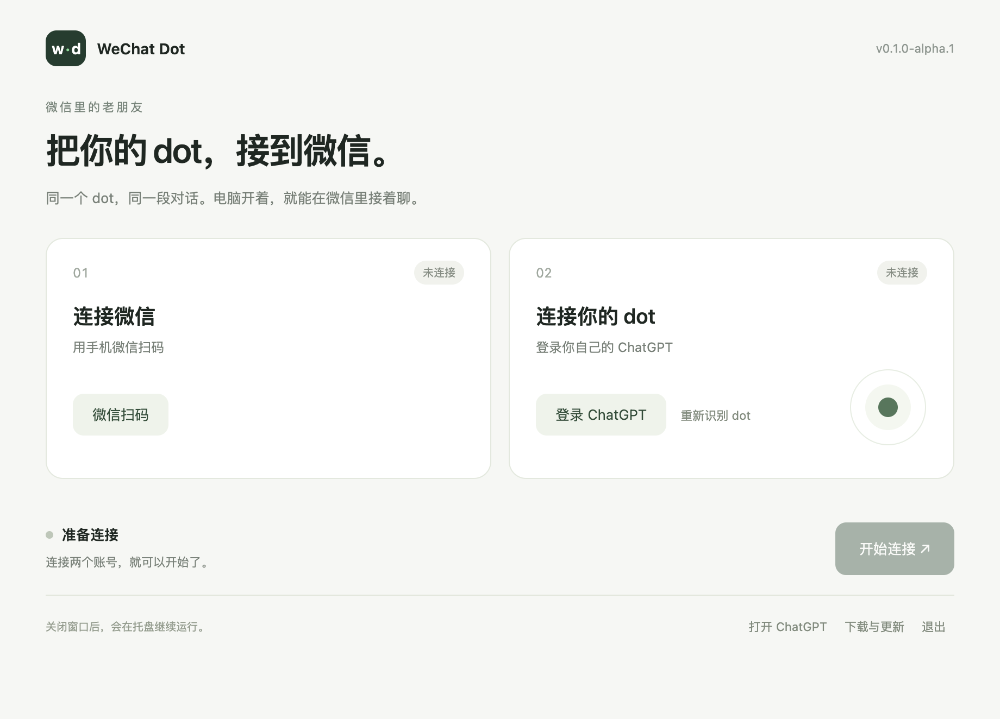

在微信里和你的 dot 聊天。

[安装包（尚未发布）](https://github.com/Yugo616/wechat-dot/releases)

安装版还在开发。真实收发和简易安装尚未完成，目前请先不要安装开发包。

目标是三步使用：

1. 下载并打开安装包。
2. 扫微信二维码，登录 ChatGPT。
3. 点击「开始连接」。

正式安装流程不要求开发者模式、手动加载扩展、安装 Node 或填写 API Key。

文字收发、主动消息和重启恢复已通过本地模拟测试。图片、文件和语音尚未接入。真实账号进度见[验证记录](docs/testing.md)。

### 电脑要一直开着吗？

要。程序平时留在 Mac 菜单栏或 Windows 托盘里；点击图标可以暂停或退出。关闭连接窗口不会停止收发。

### 用的是我原来的 dot 吗？

项目要连接的是你已有的 dot，并保留原有上下文。这一项仍在实测。

### 首次打开被系统拦住怎么办？

当前安装包尚未签名。macOS 在「系统设置 → 隐私与安全性」中选择「仍要打开」；Windows 点击「更多信息 → 仍要运行」。

### 登录过期了怎么办？

微信在程序里重新扫码；ChatGPT 在 Chrome 中正常登录后点「重新识别」。登录数据只保存在这台电脑上。

[开发说明](docs/development.md) · [上游版权](THIRD_PARTY_NOTICES.md) · [MIT](LICENSE)
